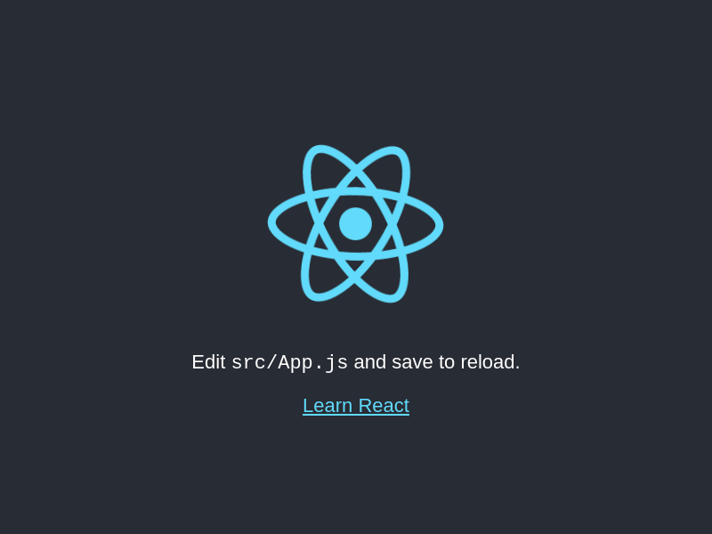

# Build a screenshot pipeline

Original project idea from CodeMentor.io : [Build a screenshot pipeline](https://www.codementor.io/projects/web/build-a-screenshot-pipeline-c22ccscro8)

## Screenshot of the web page (updated with CI)

